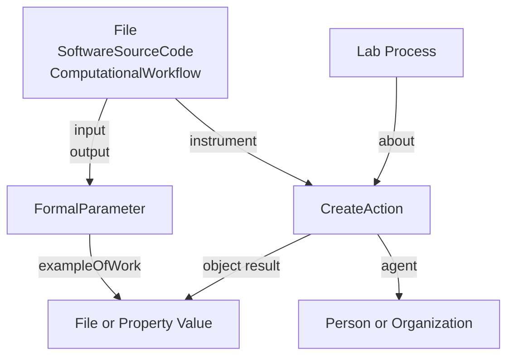

# CWL RO-Crate Profile

* Version: 0.1
* Permalink: 
* Authors
  *  - https://orcid.org/

## Overview
The ARC CWL RO-Crate profile consists of two basic parts. It is divided in the description of the workflow, that can also be a standalone workflow description, 
and the workflow invocation. The workflow invocation directly references the workflow description and provides the concrete input and output parameters for the workflow. 

### CWL Workflow Profile

The CWL Workflow Profile extends the [Bioschemas ComputationalWorkflow Profile](https://bioschemas.org/profiles/ComputationalWorkflow/1.0-RELEASE#nav-description). It adds additional properties to describe the workflow in more detail using the [LabProcess](https://bioschemas.org/types/LabProcess/0.1-DRAFT).
An example of the original profile can be found [here](https://www.researchobject.org/ro-crate/specification/1.1/workflows.html#complete-workflow-example)

### CWL Workflow Run Profile

The CWL Workflow Run Profile extends the [Workflow Run Crate](https://www.researchobject.org/workflow-run-crate/profiles/workflow_run_crate/). It adds additional properties to describe the parameters used in the workflow execution in more detail using the [LabProcess](https://bioschemas.org/types/LabProcess/0.1-DRAFT).

When adding the workflow run execution context, the "hasPart" field contains all files that are part of the invoced workflow. The "inputs" and "outputs" of the "ComputationalWorkflow" 
MAY point to the "objects" and "results" of "CreateAction" via "workExample", while the latter point to the former via "exampleOfWork".

## Requirements

### CWL Workflow Profile

The requirements of this profile are those of [Bioschemas ComputationalWorkflow Profile](https://bioschemas.org/profiles/ComputationalWorkflow/1.0-RELEASE#nav-description) 
plus the ones listed below.

#### ComputationalWorkflow
| Property | Required | Expected Type | Description |
|----------|----------|---------------|-------------|
|about|SHOULD|[bioSchemas.org/LabProcess](https://bioschemas.org/types/LabProcess/0.1-DRAFT)|The computational processes performed in this workflow|

### CWL Workflow Run Profile

The requirements of this profile are those of [Workflow Run Crate](https://www.researchobject.org/workflow-run-crate/profiles/workflow_run_crate/) 
plus the ones listed below.

#### CreateAction

| Property | Required | Expected Type | Description |
|----------|----------|---------------|-------------|
|about|SHOULD|[bioSchemas.org/LabProcess](https://bioschemas.org/types/LabProcess/0.1-DRAFT)|The computational parameters in this workflow run|


## Example ro-crate-metadata.json

#TODO Check compatibility of Bioschema WF and WF Run

### CWL Workflow Profile

```json
{ "@context": "https://w3id.org/ro/crate/1.1/context",
  "@graph": [
    {
      "@type": "CreativeWork",
      "@id": "ro-crate-metadata.json",
      "conformsTo": { "@id": "https://w3id.org/ro/crate/1.1" },
      "about": { "@id": "./" }
    },
    {
      "@id": "./workflows",
      "@type": "Dataset",
      "hasPart": [
        { "@id": "workflows/workflow.cwl" }
      ]
    },
    {
      "@id": "workflows/workflow.cwl",
      "@type": [ "File", "SoftwareSourceCode", "ComputationalWorkflow" ],
      "conformsTo": { "@id": "https://bioschemas.org/profiles/ComputationalWorkflow/1.0-RELEASE" },
      "name": "Column Addition",
      "programmingLanguage": [
        { "@id": "#FSharp" },
        { "@id": "https://w3id.org/workflowhub/workflow-ro-crate#cwl" }
      ],
      "creator": { "@id": "https://orcid.org/0000-0003-3925-6778" },
      "dateCreated": "2024-02-05",
      "input": [
        { "@id": "intensity_table" },
        { "@id": "file_name" }
      ],
      "output": [
        { "@id": "summed_intensities" }
      ]
      "about": [
        # TODO add some example metadata
        # Lab process
      ]
    },
    {
      "@id": "intensity_table",
      "@type": "FormalParameter",
      "conformsTo": { "@id": "https://bioschemas.org/profiles/FormalParameter/0.1-DRAFT-2020_07_21/" },
      "name": "intensity_table",
      "valueRequired": true,
      "additionalType": "File",
      "format": { "@id": "http://edamontology.org/format_3752" }
    },
    {
      "@id": "file_name",
      "@type": "FormalParameter",
      "conformsTo": { "@id": "https://bioschemas.org/profiles/FormalParameter/0.1-DRAFT-2020_07_21/" },
      "name": "file_name"
    },
    {
      "@id": "summed_intensities",
      "@type": "FormalParameter",
      "conformsTo": { "@id": "https://bioschemas.org/profiles/FormalParameter/0.1-DRAFT-2020_07_21/" },
      "name": "summed_intensities",
      "additionalType": "File",
      "encodingFormat": { "@id": "http://edamontology.org/format_3475" }
    },
    {
      "@id": "https://w3id.org/workflowhub/workflow-ro-crate#cwl",
      "@type": "computerlanguage",
      "name": "common workflow language",
      "alternatename": "cwl",
      "identifier": {
        "@id": "https://w3id.org/cwl/v1.2/"
      },
      "url": {
        "@id": "https://www.commonwl.org/"
      }
    },
    {
      "@id": "#FSharp",
      "@type": "ProgrammingLanguage",
      "name": "F Sharp",
      "alternateName": "F#",
      "url": "https://dotnet.microsoft.com/en-us/languages/fsharp",
      "version": "6.0"
    },
    {
      "@id": "https://orcid.org/0000-0003-3925-6778",
      "@type": "Person",
      "name": "Timo Mühlhaus"
    },
    {
      "@id": "http://edamontology.org/format_3752",
      "@type": "Thing",
      "name": "Comma-separated values"
    },
    {
      "@id": "http://edamontology.org/format_3475",
      "@type": "Thing",
      "name": "Tab-separated values"
    }
}
```

### CWL Workflow Run Profile

```json
{ "@context": [
    "https://w3id.org/ro/terms/workflow-run/context"
  ],
  "@graph": [
    {
      "@type": "CreativeWork",
      "@id": "ro-crate-metadata.json",
      "conformsTo": { "@id": "https://w3id.org/ro/crate/1.1" },
      "about": { "@id": "./" }
    },
    {
      "@id": "./workflows",
      "@type": "Dataset",
      "conformsTo": [
        {"@id": "https://w3id.org/ro/wfrun/process/0.1"},
        {"@id": "https://w3id.org/ro/wfrun/workflow/0.1"},
        {"@id": "https://w3id.org/workflowhub/workflow-ro-crate/1.0"}
      ],
      "hasPart": [
        { "@id": "workflows/workflow.cwl" },
        { "@id": "assays/measurement1/dataset/table.csv" }
        { "@id": "runs/fsResult1/result.csv" }
      ],
      "mainEntity": {"@id": "Galaxy-Workflow-Hello_World.ga"}
      #TODO Way to reference run instance to correctly fill "mentions" field?
    },
    {   "@id": "https://w3id.org/ro/wfrun/process/0.1",
        "@type": "CreativeWork",
        "name": "Process Run Crate",
        "version": "0.1"
    },
    {   "@id": "https://w3id.org/ro/wfrun/workflow/0.1",
        "@type": "CreativeWork",
        "name": "Workflow Run Crate",
        "version": "0.1"
    },
    {   "@id": "https://w3id.org/workflowhub/workflow-ro-crate/1.0",
        "@type": "CreativeWork",
        "name": "Workflow RO-Crate",
        "version": "1.0"
    },
    {
      "@id": "workflows/workflow.cwl",
      "@type": [ "File", "SoftwareSourceCode", "ComputationalWorkflow" ],
      "conformsTo": { "@id": "https://bioschemas.org/profiles/ComputationalWorkflow/1.0-RELEASE" },
      "name": "Column Addition",
      "programmingLanguage": [
        { "@id": "#FSharp" },
        { "@id": "https://w3id.org/workflowhub/workflow-ro-crate#cwl" }
      ],
      "creator": { "@id": "https://orcid.org/0000-0003-3925-6778" },
      "dateCreated": "2024-02-05",
      "input": [
        { "@id": "intensity_table" },
        { "@id": "file_name" }
      ],
      "output": [
        { "@id": "summed_intensities" }
      ]
      "about": [
        {
          "@id": "#Process_script.fsx",
          "@type": [
            "Process"
          ],
          "name": "script.fsx",
          "parameterValues": [
            {
              "@id": "ARCtrl.Json.PropertyValue+ROCrate+genID@16[ARCtrl.Process.ProcessParameterValue]/{Name = \"Data Transformation\"}Some(Ontology\n  {Name = \"Addition\"; TSR = \"NCIT\"; TAN = \"http://purl.obolibrary.org/obo/NCIT_C64911\"})",
              "@type": "PropertyValue",
              "additionalType": "ProcessParameterValue",
              "category": "Data Transformation",
              "value": "Addition",
              "valueCode": "http://purl.obolibrary.org/obo/NCIT_C64911",
              "@context": {
                "sdo": "http://schema.org/",
                "additionalType": "sdo:additionalType",
                "category": "sdo:name",
                "categoryCode": "sdo:propertyID",
                "value": "sdo:value",
                "valueCode": "sdo:valueReference",
                "unit": "sdo:unitText",
                "unitCode": "sdo:unitCode",
                "comments": "sdo:disambiguatingDescription"
              }
            }
          ],,
          "@context": {
            "sdo": "http://schema.org/",
            "bio": "https://bioschemas.org/",
            "Process": "bio:LabProcess",
            "name": "sdo:name",
            "executesProtocol": "bio:executesLabProtocol",
            "parameterValues": "bio:parameterValue",
            "performer": "sdo:agent",
            "date": "sdo:endTime",
            "inputs": "sdo:object",
            "outputs": "sdo:result",
            "comments": "sdo:disambiguatingDescription"
          }
        }
      ]
    },
    {
      "@id": "intensity_table",
      "@type": "FormalParameter",
      "conformsTo": { "@id": "https://bioschemas.org/profiles/FormalParameter/0.1-DRAFT-2020_07_21/" },
      "name": "intensity_table",
      "valueRequired": true,
      "additionalType": "File",
      "format": { "@id": "http://edamontology.org/format_3752" },
      "workExample": {"@id": "assays/measurement1/dataset/table.csv"}
    },
    {
      "@id": "file_name",
      "@type": "FormalParameter",
      "additionalType": "Text"
      "conformsTo": { "@id": "https://bioschemas.org/profiles/FormalParameter/0.1-DRAFT-2020_07_21/" },
      "name": "file_name",
      "valueRequired": true,
      "workExample": {"@id": "file_name_filled"}
    },
    {
      "@id": "summed_intensities",
      "@type": "FormalParameter",
      "conformsTo": { "@id": "https://bioschemas.org/profiles/FormalParameter/0.1-DRAFT-2020_07_21/" },
      "name": "summed_intensities",
      "additionalType": "File",
      "encodingFormat": { "@id": "http://edamontology.org/format_3475" },
      "workExample": {"@id": "runs/fsResult1/result.csv"}
    },
    {
      "@id": "https://w3id.org/workflowhub/workflow-ro-crate#cwl",
      "@type": "computerlanguage",
      "name": "common workflow language",
      "alternatename": "cwl",
      "identifier": {
        "@id": "https://w3id.org/cwl/v1.2/"
      },
      "url": {
        "@id": "https://www.commonwl.org/"
      }
    },
    {
      "@id": "#FSharp",
      "@type": "ProgrammingLanguage",
      "name": "F Sharp",
      "alternateName": "F#",
      "url": "https://dotnet.microsoft.com/en-us/languages/fsharp",
      "version": "6.0"
    },
    {
      "@id": "https://orcid.org/0000-0003-3925-6778",
      "@type": "Person",
      "name": "Timo Mühlhaus"
    },
    {
      "@id": "http://edamontology.org/format_3752",
      "@type": "Thing",
      "name": "Comma-separated values"
    },
    {
      "@id": "http://edamontology.org/format_3475",
      "@type": "Thing",
      "name": "Tab-separated values"
    }
    {
        "@id": "#wfrun-1",
        "@type": "CreateAction",
        "name": "CWL workflow run 1",
        "endTime": "",
        "instrument": {"@id": "workflows/workflow.cwl"},
        "subjectOf": {"@id": ""},
        "object": [
            {"@id": "assays/measurement1/dataset/table.csv"},
            {"@id": "file_name_filled"}
        ],
        "result": [
            {"@id": "runs/fsResult1/result.csv"}
        ]
    },
    {
        "@id": "assays/measurement1/dataset/table.csv",
        "@type": "File",
        "description": "Number columns in csv format",
        "encodingFormat": "text/plain",
        "name": "intensity_table",
        "exampleOfWork": {"@id": "intensity_table"}
    },
    {
        "@id": "#file_name_filled",
        "@type": "PropertyValue",
        "@additionalType": "Text",
        "exampleOfWork": {"@id": "file_name"},
        "name": "file_name",
        "value": "./result.csv"
    },
    {
        "@id": "runs/fsResult1/result.csv",
        "@type": "File",
        "name": "summed_intensities",
        "description": "Summed intensity columns",
        "encodingFormat": "text/plain",
        "exampleOfWork": {"@id": "summed_intensities"}
    },
    {
        "@id": "cwltool",
        "@type": "CreativeWork",
        "encodingFormat": "text/html",
        "datePublished": "",
        "name": "Workflow Execution Example Workflow"
    }
]
}
```