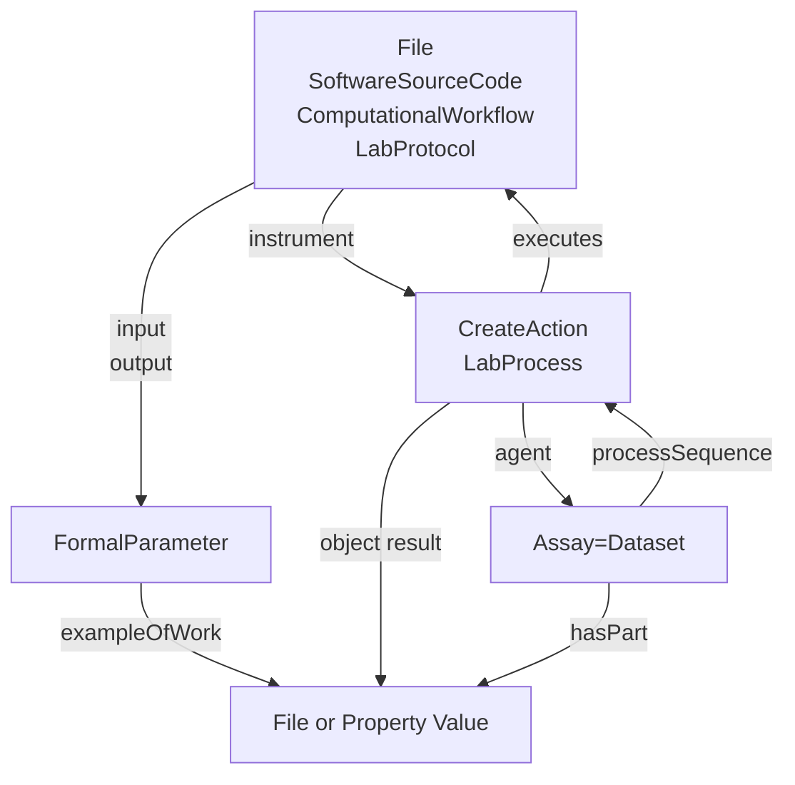

# CWL RO-Crate Profile

* Version: 0.1
* Permalink: 
* Authors
  *  - https://orcid.org/

## Overview
The ARC CWL RO-Crate profile consists of two basic parts. It is divided in the description of the workflow, that can also be a standalone workflow description, 
and the workflow invocation. The workflow invocation directly references the workflow description and provides the concrete input and output parameters for the workflow.

CWL allows the use of [metadata](https://www.commonwl.org/user_guide/topics/metadata-and-authorship.html) describing the workflows. The metadata often contains general information about licensing, authorship and affiliation, but is not limited to that. It is possible to describe the steps described by a workflow, or properties describing the run execution, in more detail. This profile aims to specify where and how the metadata contained within CWL workflow and CWL job files should be stored.

### ARC CWL Workflow Profile

The CWL Workflow Profile extends the [Bioschemas ComputationalWorkflow Profile](https://bioschemas.org/profiles/ComputationalWorkflow/1.0-RELEASE#nav-description). A computational workflow consists of an orchestrated and repeatable pattern of activity enabled by the systematic organization of resources into processes that transform materials, provide services, or process information (source Wikipedia.org). An example of the original profile can be found [here](https://www.researchobject.org/ro-crate/specification/1.1/workflows.html#complete-workflow-example)
Computational workflows and laboratory workflows show many similarities, they typically only differ in how they are executed. To stay consistent of how processes in the ARC are described, we try to stay consistent with the [ISA RO-Crate Profile](https://github.com/nfdi4plants/isa-ro-crate-profile/blob/main/profile/isa_ro_crate.md#isa-ro-crate-profile). We therefore propose to use a multi type for the workflow profile. The type is therefore extended by [LabProtocol](https://github.com/nfdi4plants/isa-ro-crate-profile/blob/main/profile/isa_ro_crate.md#labprotocol). Protocols can be described using [PropertyValue](https://schema.org/PropertyValue). Workflow complexity can vary. Workflows executing several tools in succession are common and require more complex annotation. This can be achieved by using lists of property values.

### CWL Workflow Run Profile

The CWL Workflow Run Profile extends the [Workflow Run Crate](https://www.researchobject.org/workflow-run-crate/profiles/workflow_run_crate/). This profile describes the execution of a computational tool that orchestrates other tools, represented as a workflow executed using a Workflow Management System (WMS). The Workflow Run Crate combines [Process Run Crate](https://www.researchobject.org/workflow-run-crate/profiles/process_run_crate/)  and [Workflow RO-Crate](https://about.workflowhub.eu/Workflow-RO-Crate/), requiring a ComputationalWorkflow mainEntity and [CreateAction](https://schema.org/CreateAction) instances corresponding to the execution. Workflows can have multiple input and output parameters, defined optionally as FormalParameter entities and linked to the workflow's inputs and outputs.
To continue staying consisten with the [ISA RO-Crate Profile](https://github.com/nfdi4plants/isa-ro-crate-profile/blob/main/profile/isa_ro_crate.md#isa-ro-crate-profile), we propose to add the [LabProcess](https://github.com/nfdi4plants/isa-ro-crate-profile/blob/main/profile/isa_ro_crate.md#labprocess) to the type CreateAction of the Process Run Crate within the Workflow Run Crate. This allows the annotation of inputs and outputs with metadata describing the properties of those Datasets and the processes leading from inputs to outputs.


When adding the workflow run execution context, the "hasPart" field contains all files that are part of the invoced workflow. The "inputs" and "outputs" of the "ComputationalWorkflow" 
MAY point to the "objects" and "results" of "CreateAction" via "workExample", while the latter point to the former via "exampleOfWork".

## Requirements

### CWL Workflow Profile

The requirements of this profile are those of [Bioschemas ComputationalWorkflow Profile](https://bioschemas.org/profiles/ComputationalWorkflow/1.0-RELEASE#nav-description) 
plus the ones listed below.

#### ComputationalWorkflow
| Property | Required | Expected Type | Description | CD | Controlled Vocabulary|
|----------|----------|---------------|-------------|----|----------------------|
|type|MUST|[Text](https://schema.org/Text)|schema.org/Bioschemas class for the resource declared using JSON-LD syntax. For other serialisations please use the appropriate mechanism.
While it is permissible to provide multiple types, it is preferred to use a single type.| MANY | Schema.org, Bioschemas

### CWL Workflow Run Profile

The requirements of this profile are those of [Workflow Run Crate](https://www.researchobject.org/workflow-run-crate/profiles/workflow_run_crate/) 
plus the ones listed below.

#### CreateAction

| Property | Required | Expected Type | Description |
|----------|----------|---------------|-------------|
|about|SHOULD|[bioSchemas.org/LabProcess](https://bioschemas.org/types/LabProcess/0.1-DRAFT)|The computational parameters in this workflow run|


## Example ro-crate-metadata.json

### CWL Workflow Profile

```json
{ "@context": "https://w3id.org/ro/crate/1.1/context",
  "@graph": [
    {
      "@type": "CreativeWork",
      "@id": "ro-crate-metadata.json",
      "conformsTo": { "@id": "https://w3id.org/ro/crate/1.1" },
      "about": { "@id": "./" }
    },
    {
      "@id": "./workflows",
      "@type": "Dataset",
      "hasPart": [
        { "@id": "workflows/workflow.cwl" }
      ]
    },
    {
      "@id": "workflows/workflow.cwl",
      "@type": [ "File", "SoftwareSourceCode", "ComputationalWorkflow" ],
      "conformsTo": { "@id": "https://bioschemas.org/profiles/ComputationalWorkflow/1.0-RELEASE" },
      "name": "Column Addition",
      "programmingLanguage": [
        { "@id": "#FSharp" },
        { "@id": "https://w3id.org/workflowhub/workflow-ro-crate#cwl" }
      ],
      "creator": { "@id": "https://orcid.org/0000-0003-3925-6778" },
      "dateCreated": "2024-02-05",
      "input": [
        { "@id": "intensity_table" },
        { "@id": "file_name" }
      ],
      "output": [
        { "@id": "summed_intensities" }
      ]
      "about": [
        # TODO add some example metadata
        # PropertyValue
      ]
    },
    {
      "@id": "intensity_table",
      "@type": "FormalParameter",
      "conformsTo": { "@id": "https://bioschemas.org/profiles/FormalParameter/0.1-DRAFT-2020_07_21/" },
      "name": "intensity_table",
      "valueRequired": true,
      "additionalType": "File",
      "format": { "@id": "http://edamontology.org/format_3752" }
    },
    {
      "@id": "file_name",
      "@type": "FormalParameter",
      "conformsTo": { "@id": "https://bioschemas.org/profiles/FormalParameter/0.1-DRAFT-2020_07_21/" },
      "name": "file_name"
    },
    {
      "@id": "summed_intensities",
      "@type": "FormalParameter",
      "conformsTo": { "@id": "https://bioschemas.org/profiles/FormalParameter/0.1-DRAFT-2020_07_21/" },
      "name": "summed_intensities",
      "additionalType": "File",
      "encodingFormat": { "@id": "http://edamontology.org/format_3475" }
    },
    {
      "@id": "https://w3id.org/workflowhub/workflow-ro-crate#cwl",
      "@type": "computerlanguage",
      "name": "common workflow language",
      "alternatename": "cwl",
      "identifier": {
        "@id": "https://w3id.org/cwl/v1.2/"
      },
      "url": {
        "@id": "https://www.commonwl.org/"
      }
    },
    {
      "@id": "#FSharp",
      "@type": "ProgrammingLanguage",
      "name": "F Sharp",
      "alternateName": "F#",
      "url": "https://dotnet.microsoft.com/en-us/languages/fsharp",
      "version": "6.0"
    },
    {
      "@id": "https://orcid.org/0000-0003-3925-6778",
      "@type": "Person",
      "name": "Timo Mühlhaus"
    },
    {
      "@id": "http://edamontology.org/format_3752",
      "@type": "Thing",
      "name": "Comma-separated values"
    },
    {
      "@id": "http://edamontology.org/format_3475",
      "@type": "Thing",
      "name": "Tab-separated values"
    }
}
```

### CWL Workflow Run Profile

```json
{ "@context": [
    "https://w3id.org/ro/terms/workflow-run/context"
  ],
  "@graph": [
    {
      "@type": "CreativeWork",
      "@id": "ro-crate-metadata.json",
      "conformsTo": { "@id": "https://w3id.org/ro/crate/1.1" },
      "about": { "@id": "./" }
    },-
    {
      "@id": "./workflows",
      "@type": "Dataset",
      "conformsTo": [
        {"@id": "https://w3id.org/ro/wfrun/process/0.1"},
        {"@id": "https://w3id.org/ro/wfrun/workflow/0.1"},
        {"@id": "https://w3id.org/workflowhub/workflow-ro-crate/1.0"}
      ],
      "hasPart": [
        { "@id": "workflows/workflow.cwl" },
        { "@id": "assays/measurement1/dataset/table.csv" }
        { "@id": "runs/fsResult1/result.csv" }
      ],
      "mainEntity": {"@id": "Galaxy-Workflow-Hello_World.ga"}
      #TODO Way to reference run instance to correctly fill "mentions" field?
    },
    {   "@id": "https://w3id.org/ro/wfrun/process/0.1",
        "@type": "CreativeWork",
        "name": "Process Run Crate",
        "version": "0.1"
    },
    {   "@id": "https://w3id.org/ro/wfrun/workflow/0.1",
        "@type": "CreativeWork",
        "name": "Workflow Run Crate",
        "version": "0.1"
    },
    {   "@id": "https://w3id.org/workflowhub/workflow-ro-crate/1.0",
        "@type": "CreativeWork",
        "name": "Workflow RO-Crate",
        "version": "1.0"
    },
    {
      "@id": "workflows/workflow.cwl",
      "@type": [ "File", "SoftwareSourceCode", "ComputationalWorkflow" ],
      "conformsTo": { "@id": "https://bioschemas.org/profiles/ComputationalWorkflow/1.0-RELEASE" },
      "name": "Column Addition",
      "programmingLanguage": [
        { "@id": "#FSharp" },
        { "@id": "https://w3id.org/workflowhub/workflow-ro-crate#cwl" }
      ],
      "creator": { "@id": "https://orcid.org/0000-0003-3925-6778" },
      "dateCreated": "2024-02-05",
      "input": [
        { "@id": "intensity_table" },
        { "@id": "file_name" }
      ],
      "output": [
        { "@id": "summed_intensities" }
      ]
      "about": [
      ]
    },
    {
      "@id": "intensity_table",
      "@type": "FormalParameter",
      "conformsTo": { "@id": "https://bioschemas.org/profiles/FormalParameter/0.1-DRAFT-2020_07_21/" },
      "name": "intensity_table",
      "valueRequired": true,
      "additionalType": "File",
      "format": { "@id": "http://edamontology.org/format_3752" },
      "workExample": {"@id": "assays/measurement1/dataset/table.csv"}
    },
    {
      "@id": "file_name",
      "@type": "FormalParameter",
      "additionalType": "Text"
      "conformsTo": { "@id": "https://bioschemas.org/profiles/FormalParameter/0.1-DRAFT-2020_07_21/" },
      "name": "file_name",
      "valueRequired": true,
      "workExample": {"@id": "file_name_filled"}
    },
    {
      "@id": "summed_intensities",
      "@type": "FormalParameter",
      "conformsTo": { "@id": "https://bioschemas.org/profiles/FormalParameter/0.1-DRAFT-2020_07_21/" },
      "name": "summed_intensities",
      "additionalType": "File",
      "encodingFormat": { "@id": "http://edamontology.org/format_3475" },
      "workExample": {"@id": "runs/fsResult1/result.csv"}
    },
    {
      "@id": "https://w3id.org/workflowhub/workflow-ro-crate#cwl",
      "@type": "computerlanguage",
      "name": "common workflow language",
      "alternatename": "cwl",
      "identifier": {
        "@id": "https://w3id.org/cwl/v1.2/"
      },
      "url": {
        "@id": "https://www.commonwl.org/"
      }
    },
    {
      "@id": "#FSharp",
      "@type": "ProgrammingLanguage",
      "name": "F Sharp",
      "alternateName": "F#",
      "url": "https://dotnet.microsoft.com/en-us/languages/fsharp",
      "version": "6.0"
    },
    {
      "@id": "https://orcid.org/0000-0003-3925-6778",
      "@type": "Person",
      "name": "Timo Mühlhaus"
    },
    {
      "@id": "http://edamontology.org/format_3752",
      "@type": "Thing",
      "name": "Comma-separated values"
    },
    {
      "@id": "http://edamontology.org/format_3475",
      "@type": "Thing",
      "name": "Tab-separated values"
    }
    {
        "@id": "#wfrun-1",
        "@type": "CreateAction",
        "name": "CWL workflow run 1",
        "endTime": "",
        "instrument": {"@id": "workflows/workflow.cwl"},
        "subjectOf": {"@id": ""},
        "object": [
            {"@id": "assays/measurement1/dataset/table.csv"},
            {"@id": "file_name_filled"}
        ],
        "result": [
            {"@id": "runs/fsResult1/result.csv"}
        ]
    },
    {
        "@id": "assays/measurement1/dataset/table.csv",
        "@type": "File",
        "description": "Number columns in csv format",
        "encodingFormat": "text/plain",
        "name": "intensity_table",
        "exampleOfWork": {"@id": "intensity_table"}
    },
    {
        "@id": "#file_name_filled",
        "@type": "PropertyValue",
        "@additionalType": "Text",
        "exampleOfWork": {"@id": "file_name"},
        "name": "file_name",
        "value": "./result.csv"
    },
    {
        "@id": "runs/fsResult1/result.csv",
        "@type": "File",
        "name": "summed_intensities",
        "description": "Summed intensity columns",
        "encodingFormat": "text/plain",
        "exampleOfWork": {"@id": "summed_intensities"}
    },
    {
        "@id": "cwltool",
        "@type": "CreativeWork",
        "encodingFormat": "text/html",
        "datePublished": "",
        "name": "Workflow Execution Example Workflow"
    }
]
}
```
